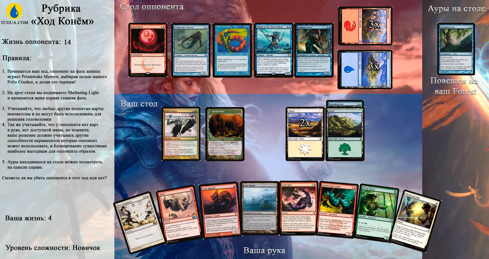

Всем привет. Мы начинаем новую рубрику "Ход конём", загадок, где ваша задача выйграть у оппонента за 1 ход, если это возможно конечно.

Наша рубрика будет выходить каждую субботу, ответы на задачи будут приниматься в телеграмм до конца воскресенья (23:00). Вам необходимо максимально подробно написать свое решение и скинуть его одним сообщением в телеграмм пользователю @redirect301. На каждую задачу у вас есть возможность отправить только один ответ. 

<h3>Важно помнить, вы можете отправить только одно сообщениес ответом! Описывайте максимально полно, откуда мана и т.п., если это важно.</h3>
Пример ответа:
Задача #1
Первая главная фаза: 1.ставлю гору
2. Получаю красную ману с горы. Играю гоблин гайда.
Фаза атаки: Иду гайдом в атаку - 2хп.
Вторая мейн фаза: Поворачиваю оставшиеся 20 гор, играю блейз на 19 с руки.
Оппонент в -1 хите.

Неправильный пример:
Короче бегу в атаку играю блейз.
(Кем бежишь, на сколько блейз)

За правильный ответ вам будет начислятся 3 балла, за неправильный - 1. Мы будем вести статистку и вывешивать её каждую неделю после задачи. В конце сезона(2 декабря), первые три места получат следующие призы за свои старания:

1. Карту Monastery Mentor
2. Коробочка для карт Jace Beleren (декбокс)
3. Чехлы ультра про для драфта

Все правила к конкретной задаче вы можете найти на изображении (увлечивается по клику)

Помните, вы можете обсуждать решение с кем и как хотите, но тем самым вы подсказываете другим игрокам найти решение, а значит ухудшаете свои шансы вырваться вперед.
Выкладывать свое решение в общий доступ запрещенно.

Ну и самое главное, эти задачи помогут вам быстрее ориентироваться в сложных ситуациях. Итак, погнали!

Дисклеймер:

1. Участвуя в данном ивенте вы даете право публиковать Ваши имя и фамилию в списке участников ивента. (а как иначе в 19ом году то?)
2. Окончательное решение по правильности вашего решения и начислении баллов принимаю только я. (не успел до 24:00 воскресенья, не качай права и т.п.)
3. Призы могут быть изменены, но не позже чем за неделю до их выдачи. (мало ли, собака ваши призы сожрет)
4. Я оставляю за собой право дисквалификации с ивента и блокирования в телеграмме. (Защита от маргиналов)
5. Запрещенно выкладывать свой ответ в публичный доступ, только сообщение в телеграмм @redirect301.
6. Правила могут быть изменены как угодно, без вашего лично уведомления.
7. В случае если несколько участников наберут одинаковое количество баллов, призовые места распределятся жеребьевкой согласно random.org.

Правильный ли ваш ответ вы узнаете в следующую субботу.