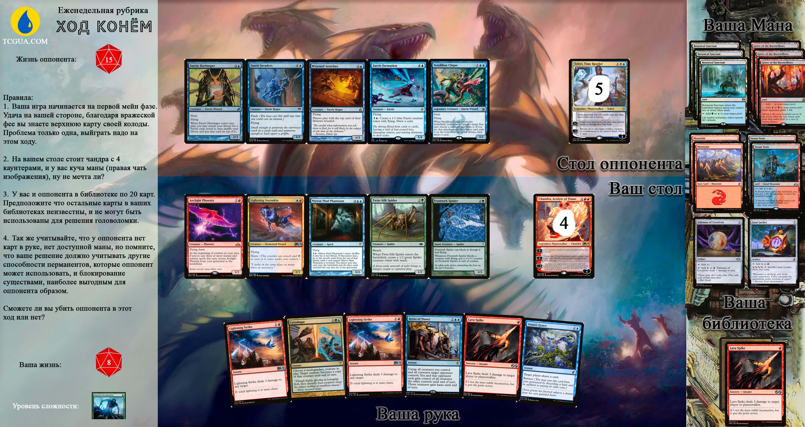

Всем привет. "Ход конём" опять с вами в субботу, и каждую субботу

Помните, вы можете отправить только одно сообщение с ответом. Продумайте его.

Отправить ответы на каждую задачу вы можете отправлять до 23:59 воскресенья. Присылайте ваши ответы в телеграмм @redirect301 одним сообщением.

Все правила к конкретной задаче вы можете найти на изображении (увлечивается по клику)

Ну и самое главное, эти задачи помогут вам быстрее находить решения в сложных ситуациях. Итак, погнали!

За правильный ответ вам будет начислятся 3 балла, за неправильный - 1. Мы будем вести статистку и вывешивать её каждую неделю после задачи. В конце сезона(2 декабря), первые три места получат следующие призы за свои старания:

1. Карту Monastery Mentor
2. Коробочка для карт Jace Beleren (декбокс)
3. Чехлы ультра про для драфта

Помните, вы можете обсуждать решение с кем и как хотите, но тем самым вы подсказываете другим игрокам найти решение, а значит ухудшаете свои шансы вырваться вперед.
Выкладывать свое решение в общий доступ запрещенно.

Дисклеймер:

1. Участвуя в данном ивенте вы даете право публиковать Ваши имя и фамилию в списке участников ивента. (а как иначе в 19ом году то?)
2. Окончательное решение по правильности вашего решения и начислении баллов принимаю только я. (не успел до 24:00 воскресенья, не качай права и т.п.)
3. Призы могут быть изменены, но не позже чем за неделю до их выдачи. (мало ли, собака ваши призы сожрет)
4. Я оставляю за собой право дисквалификации с ивента и блокирования в телеграмме. (Защита от маргиналов)
5. Запрещенно выкладывать свой ответ в публичный доступ, только сообщение в телеграмм @redirect301.
6. Правила могут быть изменены как угодно, без вашего лично уведомления.
7. В случае если несколько участников наберут одинаковое количество баллов, призовые места распределятся жеребьевкой согласно random.org.

Правильный ли ваш ответ вы узнаете в следующую субботу.

 
  
Ответ на задачу

  
  Как ни крути, нанести больше чем 14 урона у вас не получится. Самый очевидный вариант "все болты в голову" тоже не работает, потому что вы не можете использовать абилку чандры из за тефери на столе. Каст спелла из грейва является частью абилити чандры, что уже означает, что вы НЕ разыгрываете его в момент, когда можете разыграть сорсери. Такое же правило например действует для карты Finale of Promise. 
  
  
Но ответ весьма прост и его точно знаю все, кто играет в коммандер и знает в чем разница между owner и controller перманента.

   
1. Играем cytoshape выбираем своего Mirror-Mad Phantasm и делаем например вражескую Faerie Invaders его копией.

   
   
2. Играем Reins of Power, получаем контроль над всем существами оппонента и используем абилити Mirror-Mad Phantasm'a (тот который был фейкой не так давно)

 
   
3. Владец перманента(это ваш оппонент), затусовывает эту карту в свою библиотеку, где она уже снова становится фейкой, и начинает показывать карты с библиотеки, так и не найдя в ней фантазма. Вся библиоткеа врага уходит на кладбище.

  
   
4. Осталось заставить его подроваться, для этого у нас удачно в руке остался Oona's Grace. Оппонент не может взять карту и проигрывает

  
   
5. У нас ровно 12 ман любых цветов, 3+4+2+3, тут нет смысла распичывать.

   
   
P.S. Возможно кого-то ввела в заблуждение формулировка на счет карт в библиотке. Неизвестны - значит не могут повлиять на ход сражения. Предпологать что у оппонента в колоде есть свои мирор мэд фантазмы(которыми вообще-то вы играете а не он), неверно. С таким же успехом можно предположить что у вас после лава спайка лежит анцестал вижн(можно добраться сакнув иззет локет), 2 блэк лотуса, ещё анцестрал вижн, и ещё 4 лава спайка и т.п. Тогда любая задача решается только вашей фантазией :) Ну в след раз я постараюсь уточнить, что у библиотеках одни базовые земли.

   

