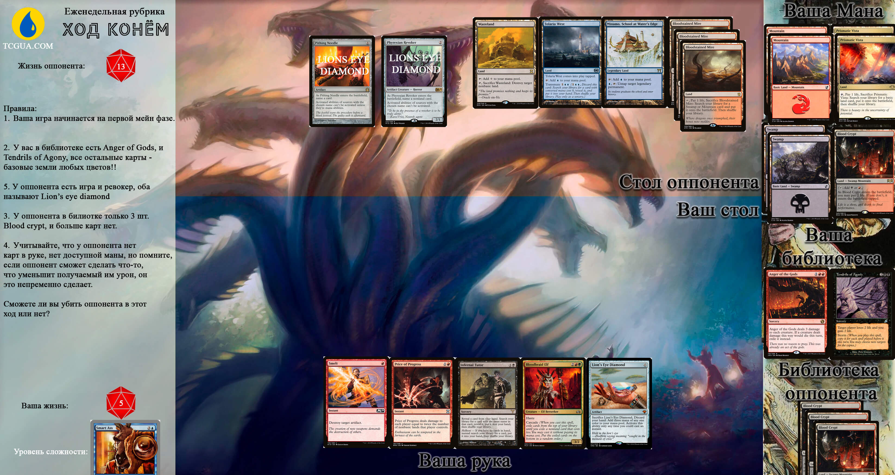

Всем привет. "Ход конём" опять с вами в субботу, и каждую субботу.

<h4>Помните, вы можете отправить только одно сообщение с ответом! Не надо говорить что вы передумали, или то был не ответ а просто размышления. Написали один раз - все :)</h4>

Отправить ответы на каждую задачу вы можете отправлять до 23:59 воскресенья. Присылайте ваши ответы в телеграмм @redirect301 одним сообщением.

Все правила к конкретной задаче вы можете найти на изображении (увлечивается по клику)

Если вы решите эту задачу, вы по праву самая умная задница! Удачи.

Про призы и дисклеймер читайте в предыдущих задачах.

Правильный ли ваш ответ вы узнаете в понедельник.

 
  
Ответ на задачу

  
Почти все оказались хитрыми жопами, и решили задачу через прайс оф прогресс, добивая себя до одного хита.
Но вот более интересный ответ.
  
  
1. Сакаем две Prismatic Vista и находим два фореста в колоде.

  
2. Поворачиваем 4 земли и разыгрываем Бладбрэйд эльфа.

  
3. После того как эльф попадет в стек, следующим туда попадает его способность каскад. Резолвим её и показывая карты сверху библиотеки мы найдем anger of gods, как единственную подходящую карту.

  
4. Ангер разыграется и убьет Phyrexian Revoker (который в отличие от иглы единственный нам мешает использовать lion's eye diamond, т.к. запрещает любые способности, в том числе и мана способности, в отличие от иглы)

  
5. Т.к. сам Эльф до сих висит в стеке, он урона от ангера не получает, после чего успешно входит в игру и бежит в атаку на 3.

  
6. Далее мы разыгрываем lion's eye diamond. Затем разыгрываем infernal tutor. Пока тутор весит в стеке, мы жертвуем lion's eye diamond, сбрасываем руку и получаем 3 черные маны. 

  
7. На резолве тутора у нас уже пустая рука, срабатывает Hellbent, мы находим Tendrils of Agony, поворачиваем оставшуюся ману и 3 маны с даймонда и разыгрываем его. Шторм страбатывает 4 раза, и того +10 -10. Оппонент умирает.

  
  
P.S. Прайс оф прогресс тоже работает, но оставляет вас в 1 хите. В стек прайсу оппонент уничтожит свою tolaria west своим wasteland, сканет 3 фечки и ничего не найдет, хотя у него полная колода земель. и того получит всего 2 урона от прогресса, как и вы :)  и -3 за сак трех фечек.

  
Что надо помнить при игре в модерн:

  
Хоть текст и похож, но иголка и ревокер совершенно разные карты. Иголка не запрезает использовать мана абилити.

  
Вы можете сакать фечки и ничего не находить.

  
Каскад попадает в стек после того заклинания, на котором он написан, а соответсвенно спелл с каскада разыграется раньше.

  
Каскад считается в шторм каунт(как и спеллы которые играет оппонент), т.к. вы разыгрываете спелл, пусть и бесплатно.

  
Hellbent проверяется на резолве, и отлично косбится с lion's eye diamond :) 

