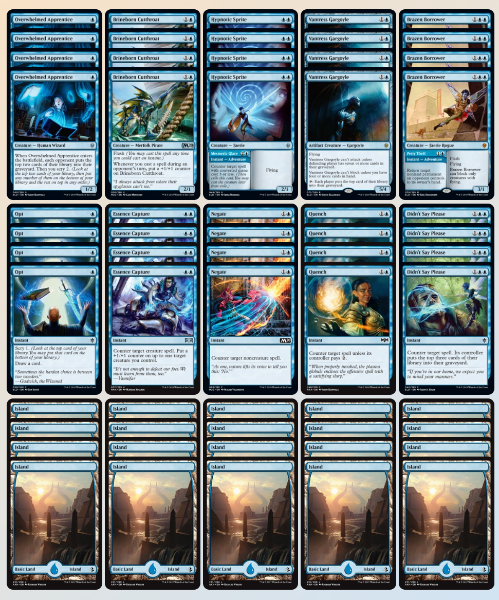

What is the best recipe to take a MTG Arena Mythic rank for every mage, who loves to counter and to attack?

Let's [keep it stupid simple](https://en.wikipedia.org/wiki/KISS_principle): 20 Islands. 20 Creatures. 20 Counterspells:

Check it by your own and may the counter force be with you. Good luck!